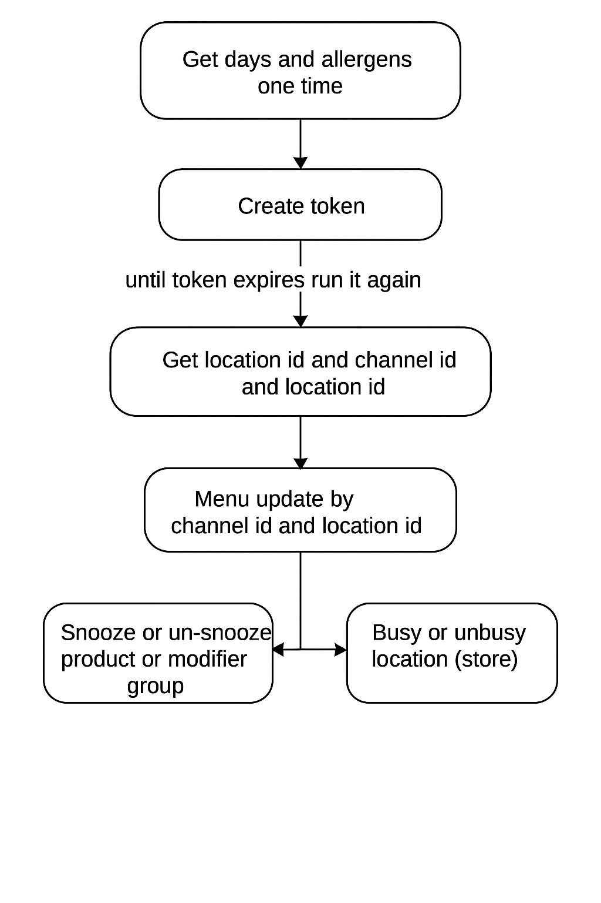
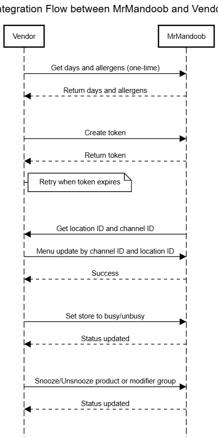
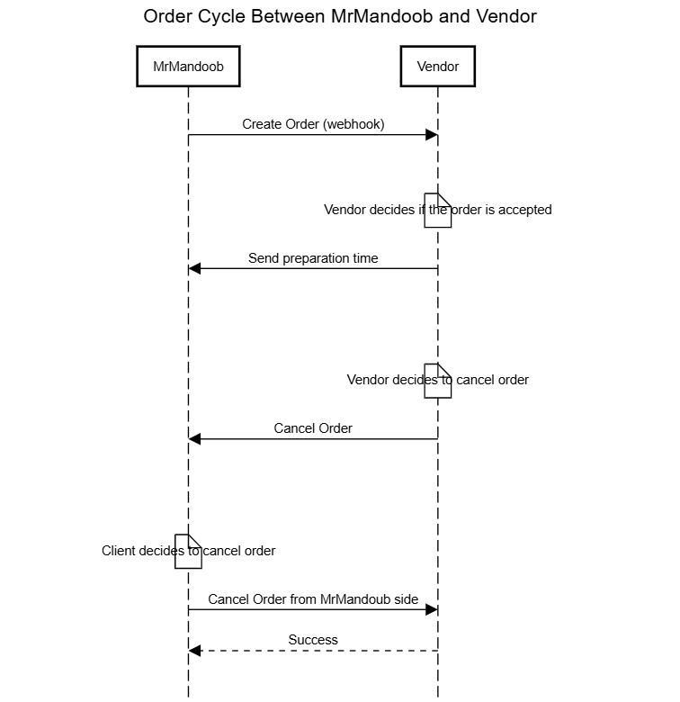

# Vendors API

### **1. Get Days [GET] Base_URL/api/v1/vendor/days**

This API is used to retrieve the available days and their IDs.

#### *Payload*

This endpoint does not require a request payload.

#### *Response*

```json
[
{
"id": 1,
"name": "الأثنين",
"name_en": "Monday",
"code": "Mon"
},
{
"id": 2,
"name": "الثلاثاء",
"name_en": "Tuesday",
"code": "Tue"
},
{
"id": 3,
"name": "الأربعاء",
"name_en": "Wednesday",
"code": "Wed"
},
{
"id": 4,
"name": "الخميس",
"name_en": "Thursday",
"code": "Thu"
},
{
"id": 5,
"name": "الجمعة",
"name_en": "Friday",
"code": "Fri",
},
{
"id": 6,
"name": "السبت",
"name_en": "Saturday",
"code": "Sat",
},
{
"id": 7,
"name": "الأحد",
"name_en": "Sunday",
"code": "Sun",
}]
```

### **2. Get allergens [GET] Base_URL/api/v1/vendor/allergens**

This API is used to retrieve all allergens.

#### *Payload*

This endpoint does not require a request payload.

#### *Response*

```json
[
{
"name": "Celery",
"allergenId": 100
},
{
"name": "Gluten",
"allergenId": 101
},
{
"name": "Crustaceans",
"allergenId": 102
},
{
"name": "Fish",
"allergenId": 103
},
{
"name": "Eggs",
"allergenId": 104
},
{
"name": "Lupin",
"allergenId": 105
},
{
"name": "Milk",
"allergenId": 106
},
{
"name": "Molluscs",
"allergenId": 107
},
{
"name": "Mustard",
"allergenId": 108
},
{
"name": "Nuts",
"allergenId": 109
},
{
"name": "Peanuts",
"allergenId": 110
},
{
"name": "Sesame",
"allergenId": 111
},
{
"name": "Soya",
"allergenId": 112
},
{
"name": "Sulphites",
"allergenId": 113
},
{
"name": "Almonds",
"allergenId": 114
},
{
"name": "Barley",
"allergenId": 115
},
{
"name": "Brazil Nuts",
"allergenId": 116
},
{
"name": "Cashew",
"allergenId": 117
},
{
"name": "Hazelnuts",
"allergenId": 118
},
{
"name": "Kamut",
"allergenId": 119
},
{
"name": "Macadamia",
"allergenId": 120
},
{
"name": "Oats",
"allergenId": 121
},
{
"name": "Pecan",
"allergenId": 122
},
{
"name": "Pistachios",
"allergenId": 123
},
{
"name": "Rye",
"allergenId": 124
},
{
"name": "Spelt",
"allergenId": 125
},
{
"name": "Walnuts",
"allergenId": 126
},
{
"name": "Wheat",
"allergenId": 127
},
{
"name": "Sugared Drink",
"allergenId": 128
},
{
"name": "Dairy",
"allergenId": 129
},
{
"name": "Lentils",
"allergenId": 130
},
{
"name": "Queensland Nuts",
"allergenId": 131
},
{
"name": "Shellfish",
"allergenId": 132
},
{
"name": "Treenuts",
"allergenId": 133
},
{
"name": "Sources Of Gluten",
"allergenId": 134
},
]
```

### **3. Create Token [POST] Auth_Base_URL/api/v1/create-token**

This API is used to create jwt tokens.

#### *Header*

```
Client-Secret:API KEY
Vendor : VENDOR_NAME
```

#### *Payload*

```json
{
  "scope": "vendors_scope",
  "grant_type": "client_credentials"
}
```

#### *Response*

#### status:200

```json
{
  "type": "Bearer",
  "token": "74a3bbcfca92f5e11289bb9876453b3c2fbc43ce7e8129c72e03a8cf57b28da6",
  "expires_at": 3599
}
```

Status 401 , 400

```json
{
  "message": "The given data was invalid."
}
```

### **4. menu-update [POST]** Base_URL/api/v1/vendor/menu-update/{location_id}

This API is used to create or update location's menu.

***Note: Price values are stored in halalas (1 SAR = 100 halalas). Multiply by 100 to convert to Saudi Riyals.***

> ***ملاحظة: يتم تخزين الأسعار بالـ هللة (1 ريال = 100 هللة). اضرب القيمة في 100 للحصول على السعر بالريال السعودي.***

#### *Header*

```
Authorization: Bearer {token}
```

#### *Payload*

```json
[
{
"reference_id": "refreance234",//reference_id to send in menu callback not required
"channelLinkId": "66e959cf18a350f58e66a397",//brand id which provided by Mrmandoob
"availabilities": [//locatiion's opening hours
{
"dayOfWeek": 1, // An integer value that indicates the day of the week for this availability (starting at 1 for Monday).
"endTime": "04:30",//A 24-hour HH:MM format notation of the start time of availability expressed in the local time of the location. must not exceed the midnight
"startTime": "00:00"//A 24-hour HH:MM format notation of the end time of availability expressed in the local time of the location,time slots on one day must not overlap
},
{
"dayOfWeek": 2,
"endTime": "23:30",
"startTime": "00:00"
},
{
"dayOfWeek": 3,
"endTime": "23:59",
"startTime": "00:00"
},
{
"dayOfWeek": 4,
"endTime": "23:00",
"startTime": "00:00"
},
{
"dayOfWeek": 5,
"endTime": "23:59",
"startTime": "00:00"
},
{
"dayOfWeek": 6,
"endTime": "23:59",
"startTime": "00:00"
},
{
"dayOfWeek": 7,
"endTime": "23:59",
"startTime": "00:00"
}
],
"categories": [
{
"_id": "6739b7fd9ee0bcefd4b61dbe",// required
"name": "Coffee", //english name
"nameTranslations": { // arabic name
"ar": "قهوة"
},
"description": "Coffee Description",//english description
"descriptionTranslations": {//arabic description
"ar": "القهوة الممتازه"
},
"imageUrl": ""//image url of the category ,
"availabilities": [],//category availabilities like location availabilities
"subProducts": [// products that exist under each category
"675187c29f7aecea91e7968e",
"681c9fe7ac16f73036318163",
"6739f55cd2825b13e6e57a79",
"673da0f3cae8ca6b92306a67",
"67ab0f48c68bf634ffba1c36"
]
}

],
"modifierGroups": {
"66e959cdc1e814b1174cf5ee": {
"_id": "66e959cdc1e814b1174cf5ee",//modifier id - required
"name": "Cooking instructions",// english name required
"nameTranslations": { // arabic name
"ar": "Cocinado"
},
"description": "Cocinado", // english description
"descriptionTranslations": { // arabic description
"ar": "كوكينادو"
},
"max": 1,//The maximum number of items the user must select
"min": 0,//The minimum number of items the user must select.
"plu": "",//This value should match the _id field
"productTags": [105], // array of allergens
"subProducts": [ // Modifier item IDs are listed under the modifiers key.
"66e959cdc1e814b1174cf5b0",
"66e959cdc1e814b1174cf5b2",
"66e959cdc1e814b1174cf5f0"
],
"snoozed": false //Indicates whether an item is snoozed at the point of a menu being published
}

},
"modifiers": {
"66e959cdc1e814b1174cf5b0": {
"_id": "66e959cdc1e814b1174cf5b0",
"name": "Rare",
"nameTranslations": {
"ar": "Poco hecho"
},
"description": "Poco hecho",
"descriptionTranslations": {
"ar": "Poco hecho"
},
"max": 0,
"min": 0,
"plu": "COOK-01",
"price": 0,
"productTags": [],
"subProducts": [],
"parentId": "66e959cdc1e814b1174cf5ee",
"snoozed": false
}
},
"products": {
"681c9fe7ac16f73036318166": {
"_id": "681c9fe7ac16f73036318166",
"name": "Min 3 max 3", //english name
"nameTranslations": {
"ar": "Min 3 max 3"//arabic name
},
"description": "Min 3 max 3",//english description
"descriptionTranslations": {//arabic description
"ar": ""
},
"imageUrl": "",
"isVariant": false,// Applicable to a product to indicate if it is a variant or not
"max": 3,//maximum number of items under a group to be purchased
"min": 3,//minimum number of items under a group to be purchased
"multiMax": 5,//max_quantity_per_order
"plu": ""//This value should match the _id field,
"price": 1000,
"subProducts": [//add the IDs of the modifier groups.,
"681c9fe7ac16f73036318167" //Modifier group IDs
],
"productTags": [105], // array of allergens
"sodium": 1,
"salt": 1,
},
"beverageInfo": {
"caffeine": 1,
},
 "snoozed": false
},
"681c9fe7ac16f73036318168": {
"_id": "681c9fe7ac16f73036318168",
"name": "Product Variant Item",
"description": "An Item Variant is a version of an Item with different ",
"descriptionTranslations": {},
"nameTranslations": {},
"imageUrl": "",
"isVariant": true,// Applicable to a product to indicate if it is a variant or not
"max": 0,//maximum number of items under a group to be purchased
"min": 0,//minimum number of items under a group to be purchased
"multiMax": 5,//max_quantity_per_order
"plu": ""//This value should match the _id field,
"price": 1000,
"productTags": [], // array of allergens
"subProducts": [//add the IDs of the modifier groups.,
"681c9fe7ac16f73036318167" //Modifier group IDs
],
"parentId": "673c4ef4898449e499cdb5d6",
"sodium": 1,
"salt": 1,
},
"beverageInfo": {
"caffeine": 1,
},
"snoozed": false //Indicates whether an item is snoozed at the point of a menu being published
}
}
}
]
```

#### *Response*

#### Status:200

```json
{
  "success": true
}
```

Status 401 , 400

```json
{
  "message": "The given data was invalid.",
  "errors": {
    "availabilities.1": [
      "Overlapping time slots found on day 1."
    ]
  }
}
```

```json
{
  "message": "JSON is not valid",
  "errors": null
}
```

Ex: [Complete Menu example](https://drive.google.com/file/d/16KQCnSq_b6eJWycBgh8d-kNs1w7d7odP/view?usp=sharing)(click)

```
Key
reference_id
channelLinkId
availabilities
availabilities[].dayOfWeek
availabilities[].startTime
availabilities[].endTime
categories
categories[]->_id
categories[].name
categories[].nameTranslations.ar
categories[].description
categories[].descriptionTranslations.ar
categories[].imageUrl
categories[].availabilities
categories[].subProducts
modifierGroups
modifierGroups.{id}._id
modifierGroups.{id}.name
modifierGroups.{id}.nameTranslations.ar
modifierGroups.{id}.description
modifierGroups.{id}.descriptionTranslations.ar
modifierGroups.{id}.max
modifierGroups.{id}.min
modifierGroups.{id}.plu
modifierGroups.{id}.productTags
modifierGroups.{id}.subProducts
modifierGroups.{id}.snoozed
modifiers
modifiers.{id}._id
modifiers.{id}.name
modifiers.{id}.nameTranslations.ar
modifiers.{id}.description
modifiers.{id}.descriptionTranslations.ar
modifiers.{id}.max
modifiers.{id}.min
modifiers.{id}.plu
modifiers.{id}.price
modifiers.{id}.productTags

modifiers.{id}.subProducts
modifiers.{id}.parentId
modifiers.{id}.snoozed
products
products.{id}._id
products.{id}.name
products.{id}.nameTranslations.ar
products.{id}.description
products.{id}.descriptionTranslations.ar
products.{id}.imageUrl
products.{id}.isVariant
products.{id}.max
products.{id}.min
products.{id}.multiMax
products.{id}.plu
products.{id}.price
products.{id}.productTags
products.{id}.subProducts
products.{id}.parentId
products.{id}.nutritionalInfo.sodium
products.{id}.nutritionalInfo.salt
products.{id}.beverageInfo.caffeine
products.{id}.snoozed
```

### **5. busy-mode [POST]** Base_URL/api/v1/vendor/busy-mode

This API is used to make a location in busy mode to stop receiving orders.

#### *Header*

```
Authorization: Bearer {token}
```

#### *Payload*

```json
{
"status": "PAUSED", // PAUSED or ONLINE
"channelLinkId": "66e959cf18a350f58e66a397",
"locationId": "66e959c418a350f58e66a359",
"accountId": "1" // required with 1
}
```

#### *Response*

Status : 200

```json
{
  "message": "Status updated"
}
```

Status 400

```json
{
  "message": "Validation failed",
  "errors": {
    "status": [
      "The selected status is invalid."
    ]
  }
}
```

### **6. Snooze Unsnooze Product or modifier item [POST]** Base_URL/api/v1/vendor/snoozeUnsnooze

This API is used to make a product or a modifier item Snooze or Unsnooze.

#### *Header*

```
Authorization: Bearer {token}
```

#### *Payload*

```json
{
  "accountId": "",
  "locationId": "5ewff4ed48ededeed",
  "channelLinkId": "5c4f5c4f5c4f5c45f",
  "operations": [
    {
      "action": "snooze",
      "data": {
        "items": [
          {
            "plu": "qws45w4s5qw4d5"
          },
          {
            "plu": "ds45cr8cr54r4c5"
          }
        ]
      }
    },
    {
      "action": "unsnooze",
      "data": {
        "items": [
          {
            "plu": "fv4f5v4f8fv"
          },
          {
            "plu": "5e48asx4e8xe5ef"
          }
        ]
      }
    }
  ]
}
```

#### *Response*

Status : 200

```json
[]
```

Status : 400

```json
{
  "message": "Validation failed",
  "errors": {
    "operations.0.data.items.1.plu": [
      "The operations.0.data.items.1.plu field is required."
    ]
  }
}
```

### **7. Update Prep Time [POST]** Base_URL/api/v1/vendor/updatePrepTime

This API is used to send order preparation time

#### *Header*

```
Authorization: Bearer {token}
```

#### *Payload*

```json
{
  "orderId": "",
  "locationId": "5ewff4ed48ededeed",
  "channelLinkId": "5c4f5c4f5c4f5c45f",
  "pickupTime": "2025-05-01 12:25:30"
}
```

#### *Response*

Status : 200

```json
[]
```

Status : 400

```json
[]
```

### **8. Cancel order [POST]** Base_URL/api/v1/vendor/order-status-update

This API is used to cancel an order.

#### *Header*

```
Authorization: Bearer {token}
```

#### *Payload*

```json
{
"channelLinkId": "66e959cf18a350f58e66a397",
"locationId": "66e959c418a350f58e66a35d9",
"channelOrderId":"256114",
"status":110 // 110 canceled , 120 failed // 20 prepared
"reason": "product not exist",
}
```

#### *Response*

Status : 200

```json
[]
```

Status : 400

```json
{
  "message": "Validation failed",
  "errors": {
    "status": [
      "The selected status is invalid."
    ]
  }
}
```

### **Vendor webhooks**

### **9. Place order [POST] vendor_**Base_URL

This API is used to place an order

#### *Header*

Expect authentication like this

```
Authorization: Bearer {token}
```

#### *Payload*

***The prices are multiplied by 100 as shown in the code (price * 100).***

If the product have a variant

```json
{
"decimalDigits": 2,
"courier": "فيصل طاشكندي",
"channelLinkId": "674d67315963175ad854311d",
"locationLinkId": "67rf45rf4r8wec4c5r5rcr5",
"channelOrderId": "208158",
"channelOrderDisplayId": "208158",
"orderType": 2,
"deliveryIsAsap": true,
"orderIsAlreadyPaid": true,
"payment": {
"amount": 1125,
"type": 0
},
"items": [
{
"plu": "P-VA-ervO-2",
"name": "Product Variant Item",
"price": 1000,
"quantity": 1,
"subItems": [ //
{
"plu": "P-VA-Nfin-2-#V500#-",
"name": "Variant 2",
"price": 500,
"quantity": 1,
"subItems": [
{
"plu": "f5fv5r9wd5vgh",
"name": "modifier group",
"price": 0,
"quantity": 1,
}
]
}
]
}
],
"note": "",
"discounts": [
{
"type": "item_percent_off",
"provider": "channel",
"name": "coupon",
"channelDiscountCode": "XRLnc35x9f",
"value": 375,
"amount": 375
}
],
"discountTotal": -375
}
```

If product does not have a variant

```json
{
"decimalDigits": 2,
"courier": "فيصل طاشكندي",
"channelLinkId": "675be95a37dcdefee3b50e70",
"locationLinkId": "67rf45rf4r8wec4c5r5rcr5",
"channelOrderId": "208157",
"channelOrderDisplayId": "208157",
"orderType": 2,
"deliveryIsAsap": true,
"orderIsAlreadyPaid": true,
"payment": {
"amount": 4800,
"type": 0
},
"items": [
{
"plu": "sk-1113",
"name": "Little Double Beef Meal",
"price": 3000,//item price
"quantity": 14,
"subItems": [
{
"plu": "sk-1113",
"name": "addition item",
"price": 0,
"quantity": 14,
"subItems": []
}
]
},
{
"plu": "sk-1114",
"name": "Little Double Crispy Meal",
"price": 3000,
"quantity": 10,
"subItems": []
},
{
"plu": "sk-1115",
"name": "2 Little Double Beef Meal",
"price": 6000,
"quantity": 5,
"subItems": []
}
],
"note": "",
"discounts": [
{
"type": "item_percent_off",
"provider": "restaurant",
"name": "coupon",
"channelDiscountCode": "ATAvQyNChC",
"value": 10200,
"amount": 10200
},
{
"type": "unknown",
"provider": "restaurant",
"name": "item discount",
"channelDiscountCode": null,
"value": 21000, //item discount * quantity
"amount": 21000
},
{
"type": "unknown",
"provider": "restaurant",
"name": "item discount",
"channelDiscountCode": null,
"value": 15000,
"amount": 15000
},
{
"type": "unknown",
"provider": "restaurant",
"name": "item discount",
"channelDiscountCode": null,
"value": 15000,
"amount": 15000
}
],
"discountTotal": -61200
}
```

#### *Expected Response*

Status : 201

```
We expect status 201 created order successfully
```

Status : 400

```
Return validation errors
```

### **10. Cancel order [POST] vendor_**Base_URL

This API is used to cancel an order from MrMandoob.

*Update: 02-02-2026*

We'll use this webhook to update all order statuses, starting with the Delivered status when the driver completes the order.

#### *Header*

Expect authentication like this

```
Authorization: Bearer {token}
```

#### *Payload*

```json
{
"channelOrderId": "1512154",
"channelOrderDisplayId": "1512154",
"cancellationReason": "Customer changed his mind",
"status": "CANCELLED", //CANCELLED or DELIVERED
"channelLinkId": 123
}
```

#### *Expected Response*

Status : 200

```
We expect status 200 order canceled successfully
```

Status : 400

```
Return validation errors
```

## **Integration cycle**



**Integration cycle**



**Order cycle**



**BigMenu**

> 🧩
>
> Big Menu Integration
>
> For supermarkets and pharmacies
>
> 

**add category**

###  **Add Category [POST]** Base_URL/api/v1/categories/add/{{partner_name}}

This API is used to create a single category for a big menu.

**Headers**

- **secretKey** -- your API key

- **apiKey** -- same value as secretKey

> ⚠️ Both headers must have **the same value** ($APIKEY) and be sent with **every request**, otherwise you'll get a **401 Unauthorized** error.

**This API is synchronous and responds instantly.**

- **en_name: English category name**


- **ar_name: Arabic category name**


- **category_id: Unique category identifier**


- **parent_id: null for parent categories**


- **image_url: Category image URL**


- **active: Category status (true/false)**


**Payload**

```json
{
  "en_name": "laptops",
  "ar_name": "لابتوبات",
  "category_id": "CAT1234567893",
  "parent_id": "",
  "image_url": "https://cdn.example.com/catalog/small/electronics.jpg",
  "active": true
}
```

Response

404

```json
{
  "status": "error",
  "message": "Merchant main menu not found."
}
```

200

```json
{
  "status": "processed",
  "message": "Category processed successfully.",
  "data": {
    "success": true,
    "local_id": 15366,
    "external_id": "CAT1234567893",
    "menu_id": "0"
  }
}
```

**edit category**

###  **Update Category [POST]** Base_URL/api/v1/categories/update/{{partner_name}}

This API is used to update a single category for a big menu.

**Headers**

- **secretKey** -- your API key

- **apiKey** -- same value as secretKey

> ⚠️ Both headers must have **the same value** ($APIKEY) and be sent with **every request**, otherwise you'll get a **401 Unauthorized** error.

**This API is synchronous and responds instantly.**

- **en_name: English category name**


- **ar_name: Arabic category name**


- **category_id: Unique category identifier**


- **parent_id: null for parent categories**


- **image_url: Category image URL**


- **active: Category status (true/false)**


**Payload**

```json
{
  "en_name": "laptops",
  "ar_name": "لابتوبات",
  "category_id": "CAT1234567893",
  "parent_id": "",
  "image_url": "https://cdn.example.com/catalog/small/electronics.jpg",
  "active": true
}
```

Response

404

```json
{
  "status": "error",
  "message": "Merchant main menu not found."
}
```

200

```json
{
  "status": "processed",
  "message": "Category processed successfully.",
  "data": {
    "success": true,
    "local_id": 15366,
    "external_id": "CAT1234567893",
    "menu_id": "0"
  }
}
```

**add products**

###  **Add products [POST]** Base_URL/api/v1/products/add/{{partner_name}}

This API is used to add products for a big menu , max 1000 products.

**Headers**

- **secretKey** -- your API key

- **apiKey** -- same value as secretKey

> ⚠️ Both headers must have **the same value** ($APIKEY) and be sent with **every request**, otherwise you'll get a **401 Unauthorized** error.

**This API is asynchronous and returns a "queued".**

- **callbackUrl :If the product addition fails, the system will send the result to the callback URL**


- **reference_id :Reference ID of the request, used to identify which request failed**


<!-- -->

- **products: Array wrapper for batch operations**


  - **id: Product identifier**


  - **en_name/ar_name: English and Arabic product names**


  - **en_description/ar_description: English and Arabic descriptions**


  - **price: Product price as decimal**


  - **is_active: Product status (true/false)**


  - **imageurls: Array of image URLs**


  - **subcategories: Array of category associations with parent references**


**Payload**

```json
{
  "callBackUrl": "yourCallbackUrl",
  "reference_id": "refercene id of request",
  "products": [
    {
      "id": "PROD123456789",
      "en_name": "iPhone 17 Pro",
      "ar_name": "آيفون 17 برو",
      "en_description": "Latest iPhone with advanced features",
      "ar_description": "أحدث آيفون مع ميزات متقدمة",
      "price": 2000.0,
      "is_active": true,
      "imageurls": [
        "https://cdn.example.com/catalog/small/iphone15pro1.jpg",
        "https://cdn.example.com/catalog/small/iphone15pro2.jpg"
      ],
      "parent_id": null,
      "subcategories": [
        {
          "id": "CAT123456789",
          "en_name": "Electronics",
          "ar_name": "إلكترونيات",
          "parentCategory": {
            "id": "CAT1234567893",
            "en_name": "Electronics",
            "ar_name": "إلكترونيات"
          }
        }
      ]
    },
    {
      "id": "PROD123456789",
      "en_name": "iPhone 17 Pro",
      "ar_name": "آيفون 17 برو",
      "en_description": "Latest iPhone with advanced features",
      "ar_description": "أحدث آيفون مع ميزات متقدمة",
      "price": 2000.0,
      "is_active": true,
      "imageurls": [
        "https://cdn.example.com/catalog/small/iphone15pro1.jpg",
        "https://cdn.example.com/catalog/small/iphone15pro2.jpg"
      ],
      "parent_id": null,
      "subcategories": [
        {
          "id": "CAT123456789",
          "en_name": "Electronics",
          "ar_name": "إلكترونيات",
          "parentCategory": null
        }
      ]
    },
    {
      "id": "PROD1234567891",
      "en_name": "iPhone 17 Pro",
      "ar_name": "آيفون 17 برو",
      "en_description": "Latest iPhone with advanced features",
      "ar_description": "أحدث آيفون مع ميزات متقدمة",
      "price": 2000.0,
      "is_active": true,
      "imageurls": [
        "https://cdn.example.com/catalog/small/iphone15pro1.jpg",
        "https://cdn.example.com/catalog/small/iphone15pro2.jpg"
      ],
      "parent_id": null,
      "subcategories": [
        {
          "id": "CAT123456789",
          "en_name": "Electronics",
          "ar_name": "إلكترونيات",
          "parentCategory": null
        }
      ]
    }
  ]
}
```

**Response**

400

```json
{
  "message": "The given data was invalid.",
  "errors": {
    "products": [
      "At least one product is required."
    ]
  }
}
```

200

```json
{
  "status": "queued",
  "message": "Products queued for processing."
}
```

**update products**

###  **Update products [POST]** Base_URL/api/v1/products/update/{{partner_name}}

This API is used to update products for a big menu , max 1000 products.

**Headers**

- **secretKey** -- your API key

- **apiKey** -- same value as secretKey

> ⚠️ Both headers must have **the same value** ($APIKEY) and be sent with **every request**, otherwise you'll get a **401 Unauthorized** error.

**This API is asynchronous and returns a "queued".**

- **callbackUrl :If the product addition fails, the system will send the result to the callback URL**


- **reference_id :Reference ID of the request, used to identify which request failed**


<!-- -->

- **products: Array wrapper for batch operations**


  - **id: Product identifier**


  - **en_name/ar_name: English and Arabic product names**


  - **en_description/ar_description: English and Arabic descriptions**


  - **price: Product price as decimal**


  - **is_active: Product status (true/false)**


  - **imageurls: Array of image URLs**


  - **subcategories: Array of category associations with parent references**


**Payload**

```json
{
  "callBackUrl": "yourCallbackUrl",
  "reference_id": "refercene id of request",
  "products": [
    {
      "id": "PROD123456789",
      "en_name": "iPhone 17 Pro",
      "ar_name": "آيفون 17 برو",
      "en_description": "Latest iPhone with advanced features",
      "ar_description": "أحدث آيفون مع ميزات متقدمة",
      "price": 2000.0,
      "is_active": true,
      "imageurls": [
        "https://cdn.example.com/catalog/small/iphone15pro1.jpg",
        "https://cdn.example.com/catalog/small/iphone15pro2.jpg"
      ],
      "parent_id": null,
      "subcategories": [
        {
          "id": "CAT123456789",
          "en_name": "Electronics",
          "ar_name": "إلكترونيات",
          "parentCategory": null
        }
      ]
    },
    {
      "id": "PROD123456789",
      "en_name": "iPhone 17 Pro",
      "ar_name": "آيفون 17 برو",
      "en_description": "Latest iPhone with advanced features",
      "ar_description": "أحدث آيفون مع ميزات متقدمة",
      "price": 2000.0,
      "is_active": true,
      "imageurls": [
        "https://cdn.example.com/catalog/small/iphone15pro1.jpg",
        "https://cdn.example.com/catalog/small/iphone15pro2.jpg"
      ],
      "parent_id": null,
      "subcategories": [
        {
          "id": "CAT123456789",
          "en_name": "Electronics",
          "ar_name": "إلكترونيات",
          "parentCategory": null
        }
      ]
    },
    {
      "id": "PROD1234567891",
      "en_name": "iPhone 17 Pro",
      "ar_name": "آيفون 17 برو",
      "en_description": "Latest iPhone with advanced features",
      "ar_description": "أحدث آيفون مع ميزات متقدمة",
      "price": 2000.0,
      "is_active": true,
      "imageurls": [
        "https://cdn.example.com/catalog/small/iphone15pro1.jpg",
        "https://cdn.example.com/catalog/small/iphone15pro2.jpg"
      ],
      "parent_id": null,
      "subcategories": [
        {
          "id": "CAT123456789",
          "en_name": "Electronics",
          "ar_name": "إلكترونيات",
          "parentCategory": null
        }
      ]
    }
  ]
}
```

**Response**

400

```json
{
  "message": "The given data was invalid.",
  "errors": {
    "products": [
      "At least one product is required."
    ]
  }
}
```

200

```json
{
  "status": "queued",
  "message": "Products queued for processing."
}
```

**Add promotion**

###  **Add promotion [POST]** Base_URL/api/v1/productDiscount/add/{{partner_name}}

This API is used to add a discount on specific products.

**Headers**

- **secretKey** -- your API key

- **apiKey** -- same value as secretKey

> ⚠️ Both headers must have **the same value** ($APIKEY) and be sent with **every request**, otherwise you'll get a **401 Unauthorized** error.


**Payload**

```json
{
  "branch_id": "BRANCH001",
  "product_pid": "PROD123456789",
  "discount_price": 3599.0,
  "start_date": "2025-12-20",
  "end_date": "2025-12-31",
  "description": "iPhone 15 Pro New Year Sale"
}
```

**Response**

400

```json
{
  "status": "error",
  "message": "Failed to create promotion, Product or branch not found."
}
```

```json
{
  "status": "error",
  "message": "Failed to create promotion, Promotion already exists for product: 289375 in branch: 641241"
}
```

200

```json
{
  "status": "processed",
  "data": {
    "promotion_id": 430
  },
  "message": "Promotion processed successfully"
}
```

**update promotion**

###  **Update promotion [POST]** Base_URL/api/v1/productDiscount/update/{{partner_name}}

This API is used to update a discount date or description only.

**Headers**

- **secretKey** -- your API key

- **apiKey** -- same value as secretKey

> ⚠️ Both headers must have **the same value** ($APIKEY) and be sent with **every request**, otherwise you'll get a **401 Unauthorized** error.


**Payload**

```json
{
  "branch_id": "BRANCH001",
  "product_pid": "PROD123456789",
  "start_date": "2025-12-20",
  "end_date": "2025-12-31",
  "description": "iPhone 15 Pro New Year Sale"
}
```

**Response**

400

```json
{
  "status": "error",
  "message": "Failed to create promotion, Product or branch not found."
}
```

```json
{
  "status": "error",
  "message": "Failed to create promotion, Promotion already exists for product: 289375 in branch: 641241"
}
```

200

```
"status": "processed",
"data": {
"promotion_id": 430
},
"message": "Update Promotion processed successfully"
}
```

**delete promotion**

###  **Delete promotion[POST]** Base_URL/api/v1/productDiscount/delete/{{partner_name}}

This API is used to delete a discount.


**Headers**

- **secretKey** -- your API key

- **apiKey** -- same value as secretKey

> ⚠️ Both headers must have **the same value** ($APIKEY) and be sent with **every request**, otherwise you'll get a **401 Unauthorized** error.

**Payload**

```json
{
"branch_id": "BRANCH001",
"product_pid": "PROD123456789",
}
```

**Response**

400

```json
{
  "status": "error",
  "message": "Failed to delete promotion, Product or branch not found."
}
```

```json
{
  "status": "error",
  "message": "Failed to delete promotion, Promotion already exists for product: 289375 in branch: 641241"
}
```

200

```json
{
  "status": "success",
  "message": "Promotion deleted successfully."
}
```

**Product Inventory**

###  **Product Inventory[POST]** Base_URL/api/v1/productInventory/sync/{{partner_name}}

This API is used update qty and availability


**Headers**

- **secretKey** -- your API key

- **apiKey** -- same value as secretKey

> ⚠️ Both headers must have **the same value** ($APIKEY) and be sent with **every request**, otherwise you'll get a **401 Unauthorized** error.

**Payload**

```json
{
  "data": [
    {
      "branch_id": "location_id_641241",
      "product_id": "PROD1234567891",
      "status": "available",
      "qty": 0
    },
    {
      "branch_id": "67a9e7cbe8c87415d517b42f",
      "product_id": "PROD987654321",
      "status": "unavailable",
      "qty": 0
    },
    {
      "branch_id": "BRANCH002",
      "product_id": "PROD123456789",
      "status": "available",
      "qty": 25
    }
  ]
}
```

**Response**

400

```json
{
  "status": "error",
  "message": "Failed to process products , Branch or Product not found"
}
```

200

```json
{
  "status": "processed",
  "message": "Inventory processed successfully."
}
```

**Cancel order**

### **Update order [POST]** Base_URL/api/v1/partner/order-update

This API is used to update an order.

**Headers**

- **secretKey** -- your API key

- **apiKey** -- same value as secretKey

#### *Payload*

- partner_order_id (string, required): Unique identifier for the partner order


- status (string, required): ex: D,C,A New status of the order (e.g., "delivered", "canceled", "accepted")


```json
{
  "partner_order_id": "{{sample_partner_order_id}}",
  "status": "C"
}
```

#### *Response*

Status : 200

```json
[]
```

Status : 400

```json
{
  "message": "Validation failed",
  "errors": {
    "status": [
      "The selected status is invalid."
    ]
  }
}
```
